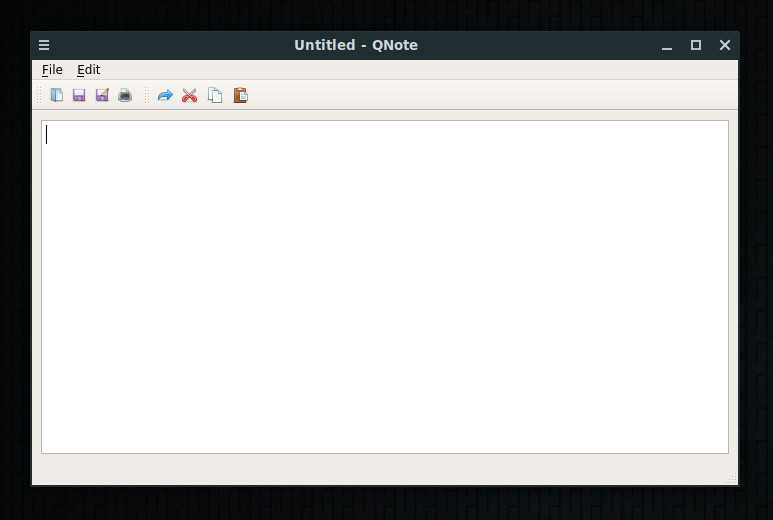

# QNote — A Notepad clone in PyQt

A very simple notepad clone using the QTextEdit widget to handle more or less
everything. Supports file loading, saving and printing.

### HTOUKOUR COGNITIVE
https://htoukour.co.za
